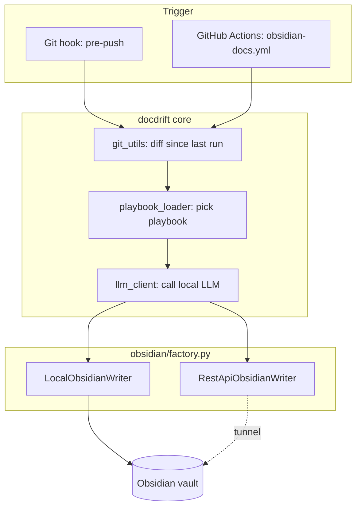
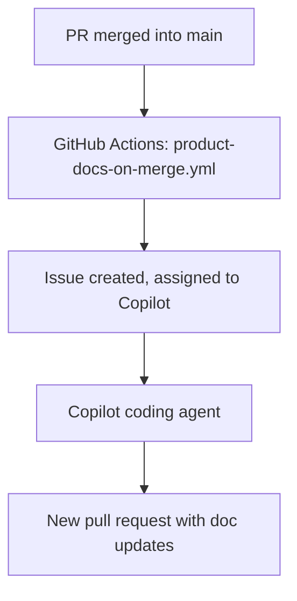

# docdrift

A plug-and-play tool that automatically documents your projects in Obsidian
using a local LLM (Ollama / LM Studio), triggered by `git push`, plus a
second, independent flow that keeps product documentation in your repo in
sync via the GitHub Copilot coding agent.

> Status: 🚧 under development!

## Why

Documentation drifts. Code changes on every commit, docs only change when
someone remembers to update them by hand. `docdrift` closes that gap for two
different kinds of documentation, using two different mechanisms, because
they have different audiences and different constraints:

- **Private, technical notes** (how a module works, why a decision was made)
  belong in your own Obsidian vault, not in the repo, you don't want half-
  finished thoughts or personal shorthand in a public README.
- **Product documentation** (README, docs/) belongs in the repo itself, and
  benefits from review via a normal pull request before it's merged.

## Concept

`docdrift` provides two independent documentation flows.

### Flow 1: internal technical documentation (Obsidian)

Changed files are identified via `git diff`, sent to a locally running LLM
(Ollama/LM Studio) together with a configurable "playbook" (a system prompt
per file type), and the corresponding note in your Obsidian vault is created
or updated.

Two independent choices apply here, both set in `.docdrift/config.yaml`:

| Axis | Options | Why it matters |
|---|---|---|
| **Trigger** | local `pre-push` git hook, or a GitHub Actions workflow | The hook runs wherever you push from. The workflow runs on GitHub's infrastructure (or a self-hosted runner) instead, useful if you want the doc update to happen independently of your local machine. |
| **Vault access** | direct filesystem access, or Obsidian's "Local REST API" plugin over a tunnel | Direct access is simpler and works even when Obsidian is closed, but requires the writing process to run on the same machine as the vault. The REST API path works from anywhere (e.g. a GitHub-hosted runner) but requires Obsidian to be open and a tunnel (e.g. Tailscale) to reach it. |

These two axes are independent and combine freely, see
[Configuration](#configuration) below.

### Flow 2: product documentation in the repository (Copilot)

When a pull request is merged into `main`, a GitHub Actions workflow creates
an issue summarizing the change and assigns it to the GitHub Copilot coding
agent. The agent works asynchronously and opens its own pull request with the
updated product documentation, which you then review and merge like any other
PR.

This flow never touches Obsidian, it only ever proposes changes to files
inside the repository, via a normal PR you control.

The two flows are used independently. Neither depends on the other being
enabled.

## Architecture

### Flow 1



`cli.py` is the only module that talks to `click`, Everything else is plain,
importable Python (`git_utils.py`, `llm_client.py`, `playbook_loader.py`,
`state.py`, `obsidian/*`) so it can be tested or reused independently of the
CLI. `obsidian/factory.py` is the single place that decides between
`LocalObsidianWriter` and `RestApiObsidianWriter` based on
`obsidian.access_mode`, the rest of the code only ever talks to the
`ObsidianWriter` protocol defined in `obsidian/base.py`.

### Flow 2



No local process is involved here at all, everything after the merge
happens on GitHub's infrastructure.

## Directory structure

```
docdrift/
├── src/docdrift/
│   ├── cli.py                    # entry point: init, init-github-*, run
│   ├── config.py                 # loads/writes .docdrift/config.yaml
│   ├── git_utils.py               # diff, changed files, commit tracking
│   ├── llm_client.py               # OpenAI-compatible client (Ollama/LM Studio)
│   ├── playbook_loader.py          # picks + loads the right playbook
│   ├── state.py                    # tracks the last documented commit
│   ├── obsidian/
│   │   ├── base.py                 # ObsidianWriter protocol + shared helpers
│   │   ├── local_writer.py         # direct filesystem access
│   │   ├── rest_api_writer.py      # via Obsidian's Local REST API plugin
│   │   └── factory.py              # picks a writer based on config
│   ├── hooks/pre-push.template
│   ├── github_workflows/
│   │   ├── obsidian-docs.yml.template
│   │   └── product-docs-on-merge.yml.template
│   └── playbooks/{base,python,typescript,fallback}.md
├── examples/                     # config + workflow reference files
├── docs/                          # setup guides (REST API tunnel, self-hosted runner)
└── tests/
```

## The `AUTO-DOC-END` marker

A note docdrift writes will eventually be edited by hand, you'll want to add
your own thoughts. To avoid `docdrift run` silently overwriting them, every
generated note ends with a marker:

```markdown
## Changes
- 2026-09-20: created

<!-- AUTO-DOC-END -->
Your own notes go here — anything below this line is preserved on the
next automatic update, verbatim.
```

On every write, `obsidian/base.py`'s `merge_with_manual_section()` reads the
existing note, keeps everything after the marker, and reattaches it to the
newly generated content above the marker.

## Installation

```bash
# From your local clone, in an isolated environment (recommended)
python3 -m venv .venv
source .venv/bin/activate
pip install -e /path/to/docdrift

# Once stable, install directly from GitHub
pip install git+https://github.com/<your-user>/docdrift.git

# Or, to make the `docdrift` command available globally across projects
pipx install --editable /path/to/docdrift
```

## Quick start

In any target project, run the commands for the flow(s) you want:

```bash
cd my-other-project

# Flow 1, local trigger (git hook)
docdrift init

# Flow 1, GitHub trigger (Actions workflow, instead of or in addition to the hook)
docdrift init-github-obsidian

# Flow 2 (Copilot product documentation on merge)
docdrift init-github-product
```

`docdrift init` creates:
- `.docdrift/config.yaml`: configuration, pre-filled with defaults (see below)
- `.git/hooks/pre-push`: the local trigger
- `.docdrift/state/`: tracks the last documented commit (added to
  `.gitignore` automatically, since it's machine-local information)

Each `init-github-*` command writes the matching file to
`.github/workflows/`.

To run Flow 1 manually, without pushing:

```bash
docdrift run                       # diff since the last documented commit
docdrift run --from <sha> --to <sha>   # explicit range, e.g. for backfilling
```

## Configuration

Full reference, see also
[`examples/docdrift.config.example.yaml`](examples/docdrift.config.example.yaml).

| Key | Type | Default | Notes |
|---|---|---|---|
| `repo_name` | string | folder name | Used in note paths and frontmatter |
| `api_base_url` | string | `http://localhost:11434/v1` | Ollama: `:11434/v1`, LM Studio: `:1234/v1` |
| `model` | string | `qwen2.5-coder:14b` | Any model your local server has loaded |
| `obsidian.access_mode` | `local` \| `rest_api` | `local` | See [Concept](#concept) |
| `obsidian.vault_path` | path | — | Required when `access_mode: local` |
| `obsidian.rest_api_base_url` | string | — | Required when `access_mode: rest_api`; see [`docs/obsidian-rest-api-setup.md`](docs/obsidian-rest-api-setup.md) |
| `obsidian.rest_api_key` | string | — | Resolved from `${ENV_VAR}` — never store it as plain text |
| `github_docs.enabled` | bool | `false` | Flow 2 toggle (informational; the workflow file is what actually runs) |
| `github_docs.assignee` | string | `copilot` | GitHub username the issue is assigned to |
| `github_docs.docs_paths` | list | `["docs/", "README.md"]` | What counts as "product documentation" |
| `playbook_dir` | path | — | Project-specific playbooks, override the bundled defaults |
| `ignore` | list | `["tests/", "*.lock", ".docdrift/*"]` | Glob patterns, never documented |

`${ENV_VAR}` placeholders anywhere in the YAML are resolved from the
environment at load time, used for secrets like `rest_api_key`.

## Customizing playbooks

Default playbooks live in
[`src/docdrift/playbooks/`](src/docdrift/playbooks/): `base.md` (always
applied) plus a per-language file (`python.md`, `typescript.md`,
`fallback.md` for anything unrecognized). To override them for a specific
project, copy the relevant file(s) into `.docdrift/playbooks/` in that
project, `playbook_loader.py` checks there first, before falling back to
the bundled defaults.

## CLI reference

| Command | Effect |
|---|---|
| `docdrift init` | Sets up Flow 1's local trigger (hook + config + state dir) |
| `docdrift init-github-obsidian` | Sets up Flow 1's GitHub Actions trigger |
| `docdrift init-github-product` | Sets up Flow 2 (Copilot on merge) |
| `docdrift run [--from SHA] [--to SHA]` | Runs Flow 1 once, manually |

## Development

```bash
pip install -e ".[dev]"
pytest
ruff check src/
```

## License

MIT, see [LICENSE](LICENSE)